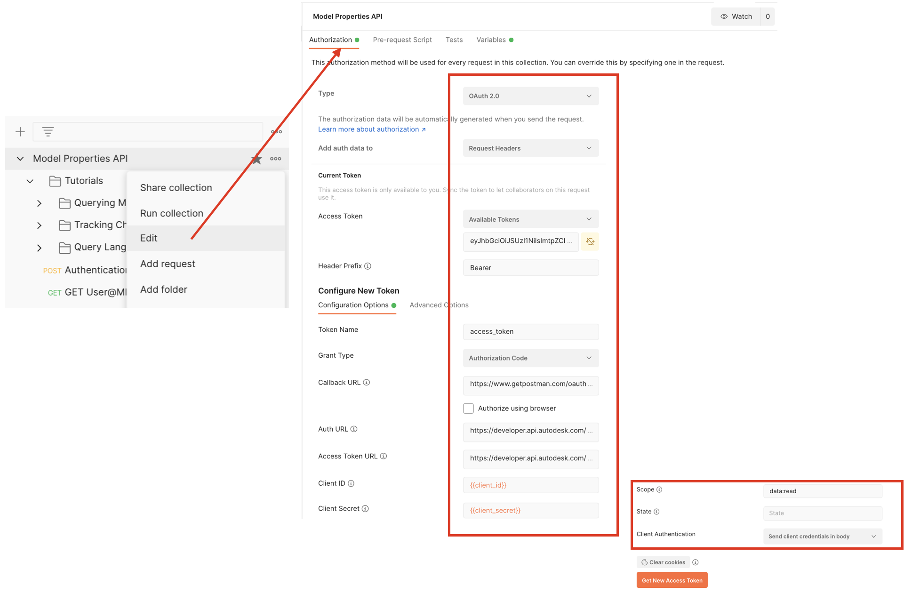
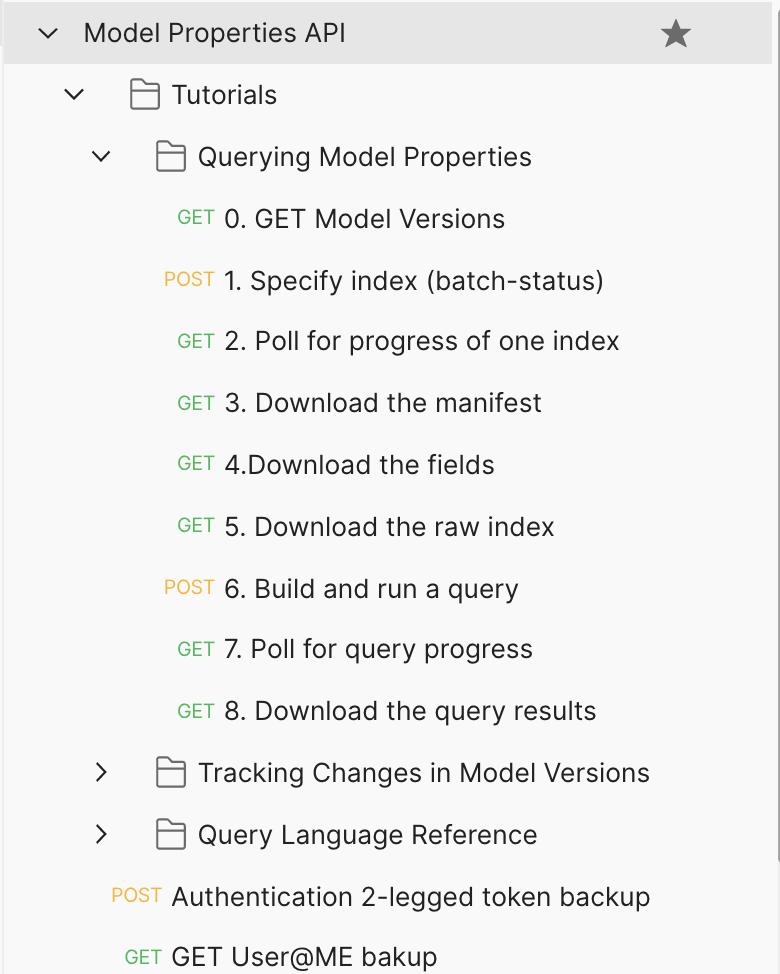

# Postman Collection for Model Properties API 

[](https://www.getpostman.com/)

[](https://forge.autodesk.com/en/docs/acc/v1/overview/field-guide/model-properties)


[](http://opensource.org/licenses/MIT)

## Description

This repository provides a postman collection that follows [three tutorials for Model Properties API](https://forge.autodesk.com/en/docs/acc/v1/tutorials/model-properties/) on Forge developer portal. This API works with BIM 360 Docs and AutodeskDocs 

The API supports **3 legged token** only.

## What's Postman?

Postman is a popular tool that provides an easy-to-use interface to send HTTP requests. Postman is able to parse the responses that Forge sends you and save response parameter values to variables. These parameters can then be reused in subsequent requests through these variables. The Postman collections in this repository use this ability to provide pre-populated HTTP requests to help you follow the tutorial workflow with minimal effort. You can also modify the requests and experiment without having to write a single line of code. 

- You can learn how to install and use Postman from [here](https://learning.getpostman.com/docs/postman/launching_postman/installation_and_updates).

- You can download the Postman installer from [here](https://www.getpostman.com/downloads/).


## Setup

1.  **Forge Account**: Learn how to create a Forge Account, activate the subscription and create an app by [this tutorial](http://learnforge.autodesk.io/#/account/). Get Forge _client id_, _client secret_ and  _callback url_. Please register Forge app with the _callback url_ as 

    ```https://www.getpostman.com/oauth2/callback```

2. **BIM 360 (or ACC) Account and project**: must be Account Admin to add the app integration. [Learn about provisioning](https://forge.autodesk.com/blog/bim-360-docs-provisioning-forge-apps). Make a note with the __account name__

3. Upload some demo models to one folder (better in any folder with **Project Files**). This Postman sample provides some [Revit models](./DemoModels). One model has two versions which can be used to test **Diff API**. 

4. Get BIM 360/ACC Docs project id (without b.) by API , or copy from browser URL bar of Docs UI. And get the folder id.

5.  Clone this repository or download it. It's recommended to install [GitHub Desktop](https://desktop.github.com/). To clone it via command line, use the following (**Terminal** on MacOSX/Linux, **Git Shell** on Windows):

    ```git clone https://github.com/Autodesk-Forge/forge-model.properties-postman.collection```

6. Import the collection and environment files to Postman

7. In environment, input _client id_, _client secret_, _project id_, _one folder id_

   <p align="center"></p>  

8. In context menu of collection >> **Edit**, switch to the tab **Authorization**. Click **Get New Access Token**, input the variables as below:

   - Grant Type ``Authorization Code``
   - Callback URL  ``https://www.getpostman.com/oauth2/callback``
   - Auth URL  ``https://developer.api.autodesk.com/authentication/v1/authorize``
   - Access Token URL  ``https://developer.api.autodesk.com/authentication/v1/gettoken``

   - Client ID ``{{client_id}}``
   - Client Secret ``{{client_secret}}``
   - Scope ``data:readx``
   - Client Authentication ``Send Client credentials body``

   <p align="center"></p> 
 
 9. Click **Get New Access Token**, it will direct to login Autodesk account, after it succeeds, the token will be generated. Click **Use Token**.  
   
   Model Properties API requires to work with 3-legged token. This collection takes **[Inheriting auth](https://learning.getpostman.com/docs/postman/sending-api-requests/authorization/#inheriting-auth)** to apply 3-legged token to every endpoint in the collection automatically, which means it does not need to input the token in the header explicitly.

## API Test

1. Assume the steps of **Setup** have been performed and the access token is ready.

2. Play the scripts, following by the tutorials. Try to change some parameters or body for more scenarios to test. 
   <p align="center"></p>   

### Tutorial 1: Querying Model Properties

This follows the tutorial [Querying Model Properties](https://forge.autodesk.com/en/docs/acc/v1/tutorials/model-properties/query)

**0. GET Model Versions** retrieves  tip version urn of first and second model in the folder. You can also hard-coded the two urns in the variables: **first_test_model_version**, **second_test_model_version**

Follow the sequence of scripts to run the endpoints one by one. It will allow you to investigate one model version only. Check the indexing status, download manifest, fields, and raw properties data of the model. It will also let you post a query, and get the properties data which meet the query condition. Check the size and content of raw properties and query properties. Normally, raw properties have more data than query properties.

### Tutorial 2: Tracking Changes in Model Versions

This follows the tutorial [Tracking Changes in Model Versions](https://forge.autodesk.com/en/docs/acc/v1/tutorials/model-properties/diff)

 **0. GET two versions of same model** gets two version urn of one model in the folder. In the sample, the two versions of Audubon_Mechanical.rvt in [Revit models](./DemoModels) are used. You can also hard-coded the two urns in the variables: **prevVersionUrn**, **curVersionUrn**

Run the sequence of script one by one. It will allow you to investigate how the diff works. Check the diff indexing status, download the manifest, fields, and raw properties data of the diff. It will also let you post a query, and get the properties data which meet the query condition. Check the size and content of raw properties and query properties. Normally, raw properties have more data than query properties.

### Tutorial 3: Query Language Reference

This follows the tutorial [Query Language Reference](https://forge.autodesk.com/en/docs/acc/v1/tutorials/model-properties/query-ref)

**0. GET one Model Version of Revit** retrieves a tip version of urn for one Revit model in the folder. You can also hard-code the two urns with the variables: **one_test_model_version**

Run the sequence of script one by one. It will allow you to investigate one model version. Check the indexing status, download manifest, fields, and raw properties data of the model. It will also allow you to post one query (the 6th endpoint), and get the properties data which meet the query condition. Check the size and content of raw properties and query properties. It has one more query (also named 6th endpoint), run it, and repeat 7th, 8th endpoint to get query properties.

## Notes
1.  If the indexing is processing, wait a few minutes to check status again
2.  If building query, please ensure the available fields contain the properties with which you want to build the query, and the correct property id (format looks like "p00723fa6")
 
 
## Further Materials
- [Model Properties API Reference](https://forge.autodesk.com/en/docs/acc/v1/reference/http/index-v2-index-jobs-batch-status-post/)
- [Querying Model Properties](https://forge.autodesk.com/en/docs/acc/v1/tutorials/model-properties/query)
- [Tracking Changes in Model Versions](https://forge.autodesk.com/en/docs/acc/v1/tutorials/model-properties/diff)
- [Query Language Reference](https://forge.autodesk.com/en/docs/acc/v1/tutorials/model-properties/query-ref)
- [Model Properties API Walkthrough in PowerShell Core](https://github.com/Autodesk-Forge/forge-model-properties.powershell)


**Blogs**:
- [Forge Blog](https://forge.autodesk.com)
- [Field of View](https://fieldofviewblog.wordpress.com/), a BIM focused blog

## License

This sample is licensed under the terms of the [MIT License](http://opensource.org/licenses/MIT). Please see the [LICENSE](LICENSE) file for full details.

## Written by

Xiaodong Liang [@coldwood](https://twitter.com/coldwood), [Developer Advacate and Support team](http://forge.autodesk.com)
